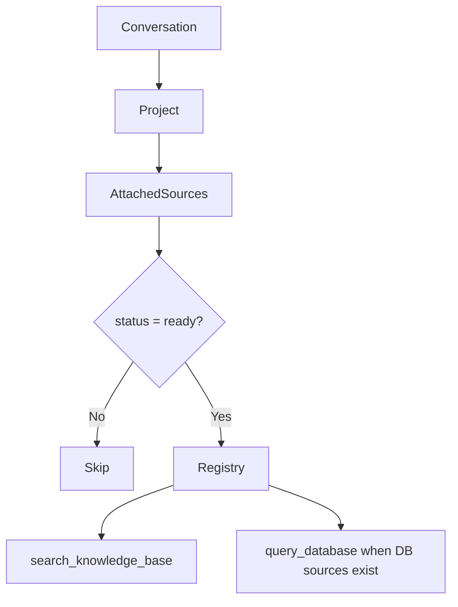
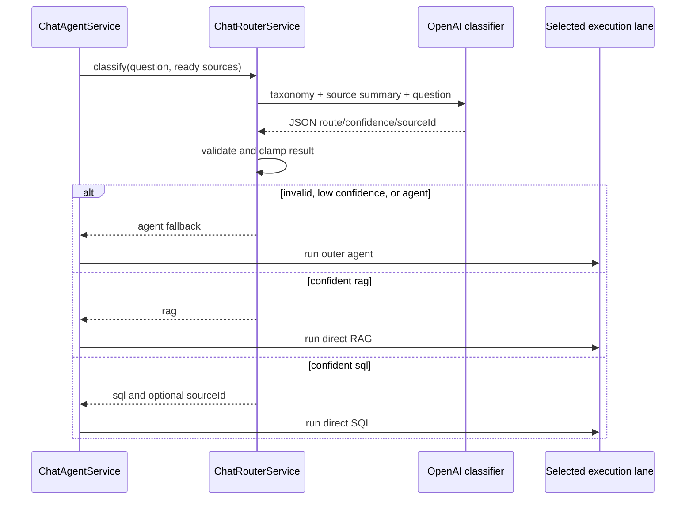
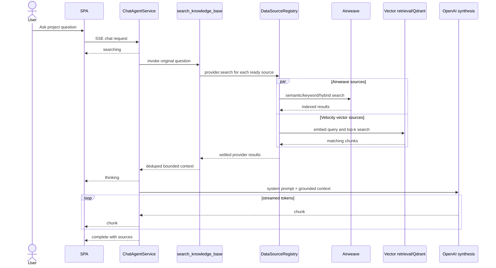
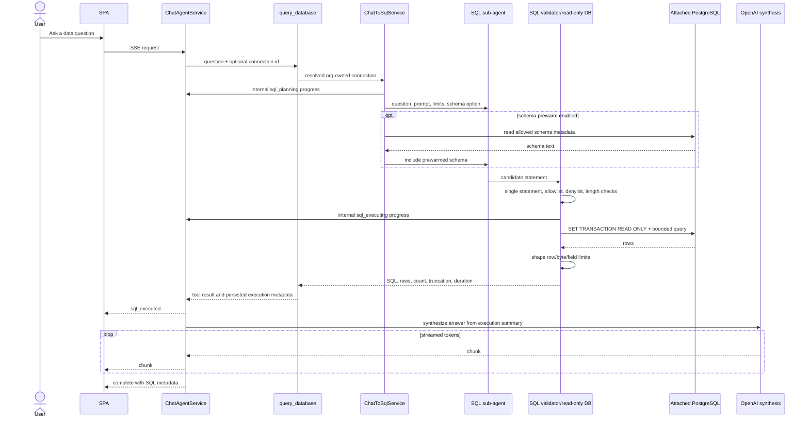
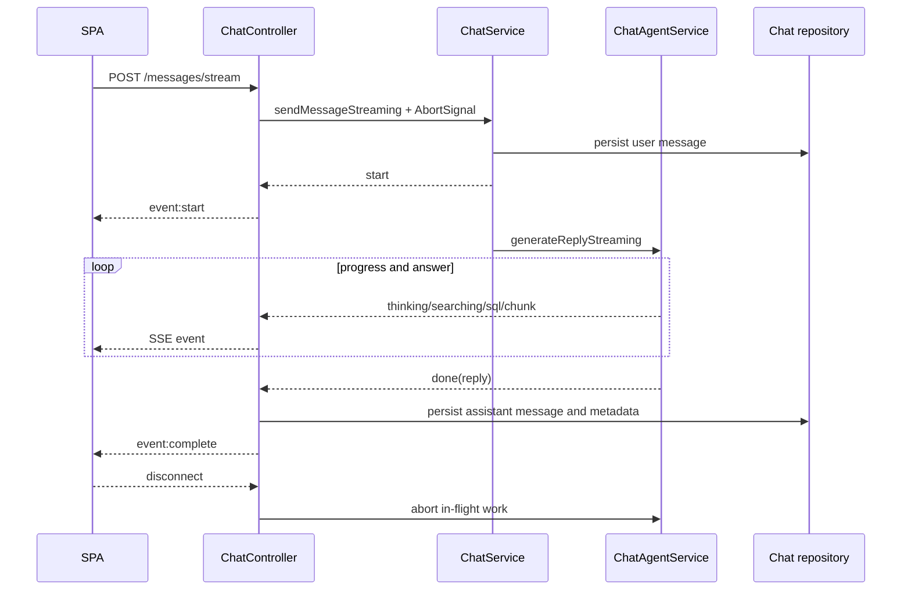
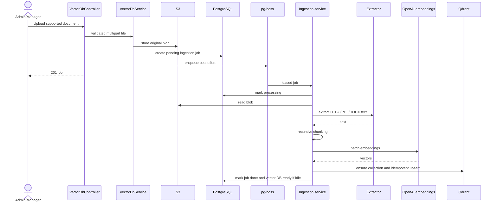

# Agentic Architecture

## Purpose

Velocity's agent runtime answers project-scoped questions using the data sources
attached to that project. It supports document retrieval, live PostgreSQL
analysis, and ambiguous multi-tool questions while preserving organization
scope and operational limits.

The implementation has two agent levels:

1. an **outer chat agent** that can select project tools and synthesize a final
   answer;
2. a **SQL sub-agent** scoped to one resolved database connection.

An optional fast router can bypass the outer tool-selection step for confident
RAG or SQL questions.

## Components

| Component | Responsibility |
|---|---|
| `ChatService` | Conversation ownership, message persistence, project/source resolution |
| `ChatAgentService` | Route dispatch, outer agent, direct lanes, streaming, answer metadata |
| `ChatRouterService` | Classify a question as `rag`, `sql`, or `agent` |
| `DataSourceRegistry` | Map project source kinds to providers and agent tools |
| `search_knowledge_base` | Fan out retrieval across search-capable sources |
| `query_database` | Resolve ready PostgreSQL sources and invoke chat-to-SQL |
| `ChatToSqlService` | Build bounded database context and run the SQL sub-agent |
| `runSqlSubAgent` | Use LangChain SQL tools to inspect schema, generate, repair, and execute SQL |
| `VectorDbIngestionService` | Convert uploaded documents into retrievable vector chunks |
| `VectorDbRetrievalService` | Embed a question and search Qdrant |

## Project-Scoped Tool Construction

Before agent execution:

1. the conversation is resolved by user and organization;
2. its project is loaded;
3. project ownership is checked;
4. project sources are loaded;
5. only sources with `status === "ready"` are retained;
6. the registry builds tools for the retained source kinds.

Search-capable sources:

- Airweave collections;
- Velocity vector databases.

Tool-capable sources:

- PostgreSQL connections expose `query_database`.

The reserved `external` source provider currently throws not implemented.

## Execution Lanes

### Router disabled or uncertain

The default path uses the outer LangChain agent. It receives:

- the expert system prompt;
- project and organization context;
- recent conversation history;
- source capability descriptions;
- `search_knowledge_base`;
- `query_database` when a ready database source is attached.

The agent can make multiple tool calls and combine evidence before synthesis.

### Confident RAG route

When `CHAT_ROUTER_ENABLED=true` and the classifier returns `rag` above the
configured threshold, Velocity:

1. calls `search_knowledge_base` directly;
2. sends retrieved context to the synthesis model;
3. streams the answer;
4. records source and route metadata.

This removes the outer agent's tool-selection call.

### Confident SQL route

When the classifier returns `sql` above threshold, Velocity:

1. constructs `query_database`;
2. invokes it directly;
3. runs the SQL sub-agent;
4. streams planning/execution events;
5. synthesizes from the persisted call summary;
6. records SQL and route metadata.

### Safe router fallback

Classifier errors, invalid JSON, invalid shapes, `agent` decisions, and
below-threshold confidence all return to the general agent path. The classifier
is not retried.

## Routing Sequence

## RAG Retrieval

`search_knowledge_base` fans out across every ready search-capable source with
`Promise.allSettled`. One source failure is logged and skipped rather than
failing the whole retrieval.

Results are:

1. normalized to a common result shape;
2. deduplicated by entity, retaining the highest relevance;
3. capped by result count and excerpt size;
4. collected for final citation metadata.

Velocity-managed vector databases add two controls before normalization:

- hits below `VECTOR_DB_MIN_SCORE_PCT` are removed from both model context and
  citations;
- each retained chunk is resolved to its uploaded document filename, while the
  vector database name remains the collection/source label.

### Direct RAG Sequence

## General Outer Agent

The outer agent uses LangChain `createAgent`. It receives a bounded history
window and a recursion limit derived from `CHAT_AGENT_MAX_ITERATIONS`.

Prompt behavior requires:

- the first knowledge search to use the user's original phrasing;
- follow-up searches only when coverage is incomplete;
- no organization-specific claims from model memory;
- explicit acknowledgement when sources are insufficient;
- SQL questions to use `query_database` before document retrieval;
- SQL values to be reported without silently reshaping them.

After execution, Velocity:

- extracts the final assistant message;
- strips leaked SQL/JSON fences when structured SQL metadata already exists;
- repairs malformed Markdown table boundaries;
- deduplicates citations;
- attaches tool, source, SQL, and token metadata;
- runs registered cleanup callbacks.

## SQL Sub-Agent

The outer `query_database` tool resolves ready connection records inside the
active organization, decrypts their passwords, and creates one request-scoped
data-source factory.

The SQL sub-agent is scoped to a single selected connection and uses LangChain's
SQL toolkit.

### SQL Sequence

## SQL Safety Model

The LLM is not trusted to enforce safety. Controls include:

### Connection boundary

- organization-scoped connection resolution;
- only `ready` connections;
- AES-256-GCM encrypted passwords;
- optional per-connection table allowlist;
- request-scoped pools and cleanup;
- SSRF validation against private/reserved addresses.

### Statement boundary

- one statement only;
- allowed starts: `SELECT`, `WITH`, `SHOW`, `EXPLAIN`;
- writes and dangerous functions/catalogs denied;
- `SELECT INTO`, write CTEs, `DO`, and non-local `SET` denied;
- SQL length limit;
- mixed-case PostgreSQL identifier repair.

### Execution boundary

- `SET TRANSACTION READ ONLY`;
- operator-provisioned SELECT-only role;
- statement, idle, and connection timeouts;
- bounded pool size;
- bounded rows, total bytes, and field bytes;
- optional table introspection allowlist.

### Output boundary

- client-safe sanitized errors;
- SQL result rows are used during the request but not persisted in message
  metadata;
- SQL text, row count, truncation, duration, and connection identity are
  retained for traceability;
- assistant prose is sanitized to avoid duplicate SQL/JSON payloads.

See [SQL operations](sql-connections-operations.md) for operator obligations and
residual risks.

## Streaming and Persistence

The chat controller uses Server-Sent Events over a POST response.

The agent domain currently emits internal `sql_planning` and `sql_executing`
events, but `ChatController` does not forward those two event types to the
browser. The public stream exposes `searching` followed by `sql_executed` for
the SQL path.

The SSE event contract is documented in [API reference](api-reference.md).

## Vector Ingestion

Velocity-managed vector databases use an asynchronous, recoverable pipeline.

Durability behavior:

- the PostgreSQL job row is the source of truth;
- startup reconciliation re-enqueues pending or stale processing jobs;
- deterministic vector point IDs make retries idempotent;
- transient failures retry with backoff up to three attempts;
- unsupported, corrupt, oversize, or text-empty documents fail terminally;
- graceful shutdown lets workers finish or release leases.

## Configuration

Key agent controls:

| Variable | Purpose |
|---|---|
| `OPENAI_MODEL` | Default outer agent and synthesis model |
| `CHAT_AGENT_MAX_ITERATIONS` | Outer agent tool-call budget |
| `CHAT_AGENT_HISTORY_WINDOW` | Included conversation history |
| `CHAT_AGENT_TOOL_RESULT_LIMIT` | Retrieval results per call |
| `CHAT_AGENT_TOOL_RESULT_CHAR_CAP` | Excerpt cap per result |
| `CHAT_AGENT_MAX_SOURCES` | Citation metadata cap |
| `CHAT_AGENT_SEARCH_TIER` | Airweave `classic` or `instant` |
| `CHAT_AGENT_RETRIEVAL_STRATEGY` | Semantic, keyword, hybrid, or provider default |
| `VECTOR_DB_MIN_SCORE_PCT` | Minimum vector similarity percentage; `30` by default and `0` disables filtering |
| `CHAT_ROUTER_ENABLED` | Enable direct route classification |
| `CHAT_ROUTER_MODEL` | Optional classifier model |
| `CHAT_ROUTER_CONFIDENCE_PCT` | Minimum confidence for direct dispatch |
| `SQL_AGENT_MODEL` | Optional SQL sub-agent model |
| `SQL_AGENT_MAX_ITERATIONS` | SQL repair/tool budget |
| `SQL_AGENT_PREWARM_SCHEMA_ENABLED` | Load schema before agent execution |
| `SQL_AGENT_DROP_CHECKER_ENABLED` | Remove the extra query-checker LLM call |

See `.env.example`, [Chat tuning](chat-tuning-guide.md), and
[Deployment and operations](deployment-and-operations.md).

## Trust, Quality, and Cost Posture

### Deterministic boundaries

Authorization, organization ownership, source readiness, SQL validation,
read-only execution, result limits, and provider credential access are enforced
outside the LLM. Model output can select or parameterize an allowed tool, but it
cannot grant itself a new organization, source, database role, or statement
class.

### Prompt injection

The system prompt instructs the model to treat retrieved content as data, ignore
embedded instructions, and avoid reproducing secret-looking values. Tool
construction also limits the model to ready sources already authorized for the
project.

These controls reduce risk but do not prove resistance to prompt injection.
There is no separate content-classification gateway or deterministic policy
engine for all generated prose. High-risk deployments should add adversarial
retrieval tests and explicit output policies for their data classes.

### Evaluation coverage

Current tests cover routing, fallback behavior, SQL safety, streaming fences,
response formatting, retrieval adapters, and integration paths. The current
feature line also has a synthetic Nimbus Data Systems artifact at
`rag-benchmark/REPORT.md`, dated June 11, 2026. Its 100 questions run through
the real UI over six PDF/DOCX documents and reported:

| Metric | Result |
|---|---|
| Strict correct and complete answers | 90% |
| Correct plus partial answers | 96% |
| Expected document hit@1 / hit@3 / hit@any | 88% / 95% / 96% |
| Average / p95 answer latency | 6.3 s / 8.0 s |

This is a useful retrieval and answer-quality baseline, but it is not a
representative business-domain release gate. The corpus is fictional, flagged
answers were manually reviewed, all questions shared one long conversation,
and the suite does not yet comprehensively score:

- factual correctness against expected evidence;
- citation relevance and completeness;
- SQL route and connection selection;
- safe refusal and insufficient-evidence behavior;
- prompt-injection resistance;
- latency and cost by question class;
- regressions across model, prompt, retrieval, and schema changes.

Each production domain should own a versioned evaluation set and release
thresholds, with the synthetic suite retained as a repeatable regression
baseline. Unit and integration tests prove software behavior; they do not prove
answer quality for a customer's domain.

### Provenance and cost accounting

Conversation metadata records generator type, sources, SQL execution metadata,
and token usage when the model exposes it. Current telemetry has limitations:

- SQL sub-agent internal calls and tokens are not fully included;
- `llmCalls` can be an approximation;
- model and prompt hashes are not a complete persisted execution ledger;
- provider costs outside the outer model are not attributed per tenant;
- there are no per-organization budgets or hard quotas.

Do not use the current token field as a billing-grade meter. Production cost
governance requires complete usage collection, tenant attribution, budgets,
alerts, and a defined response when a limit is reached.

### Human responsibility

Citations and SQL metadata improve traceability, but they do not make generated
answers correct. Consequential decisions should require a user to inspect the
evidence, and autonomous high-risk actions should remain out of scope unless a
separate approval workflow is implemented.

## Failure Behavior

| Failure | Behavior |
|---|---|
| No OpenAI key | The full application currently fails startup because the vector embedding adapter requires the key; keyless chat fallback only applies when that adapter is not constructed |
| Router failure | General agent fallback |
| One retrieval provider fails | Other providers continue |
| Direct SQL tool fails | Error reply for the committed SQL lane; no hidden retry |
| RAG synthesis fails | Degraded source-count response |
| SQL synthesis fails | Degraded execution summary |
| Client disconnects | Abort signal cancels in-flight tool work where supported |
| Ingestion transient failure | Queue retry with backoff |
| Ingestion deterministic failure | Terminal failed job |

## Extension Points

### Add a retrieval source

1. add the source union variant;
2. implement `DataSourceProvider.search`;
3. register it in `DataSourceRegistry`;
4. add project attachment validation;
5. normalize results to the shared retrieval shape;
6. add agent and integration coverage.

### Add an agent tool source

Implement `getAgentTools(sources, context)` on the provider. Use the context for
organization, user, project, abort, events, persisted calls, and cleanup.

### Change routing

The SQL/RAG/ambiguous taxonomy is shared by the classifier prompt and the outer
agent. Update the single routing-rules source and test both consumers together.
