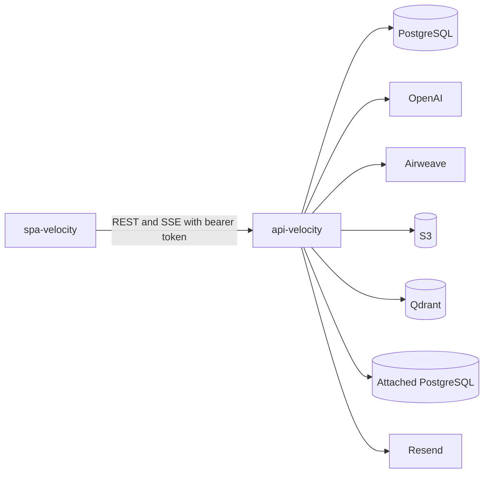
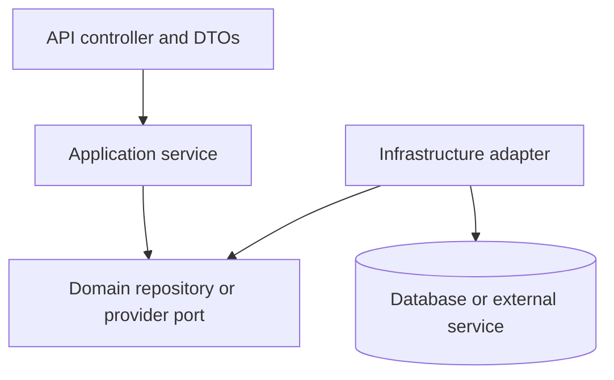
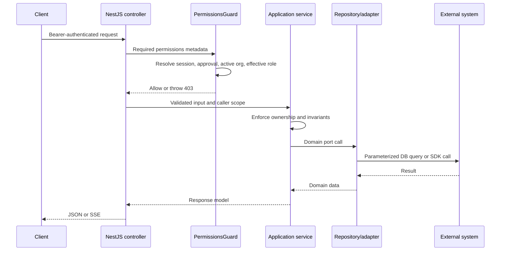
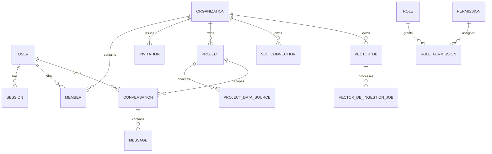

# Backend Architecture

## System Role

`api-velocity` is the trusted execution boundary for Velocity. The browser
never receives infrastructure credentials or directly invokes LLM, Airweave,
S3, Qdrant, or customer database APIs.



## Architectural Style

The backend is a modular NestJS application. New domain modules follow a
clean/hexagonal architecture:

```text
api -> application -> domain <- infrastructure
```



The dependency rule keeps application logic independent from SDKs. For example,
the vector ingestion service depends on ports for file storage, extraction,
chunking, embedding, queueing, persistence, and vector storage. SDK imports are
confined to infrastructure adapters.

## Module Composition

`AppModule` imports modules in this order:

1. configuration;
2. email;
3. raw database access;
4. TypeORM;
5. shared guards and decorators;
6. RBAC;
7. administration;
8. Airweave;
9. SQL connections;
10. vector databases;
11. projects;
12. chat;
13. Better Auth.

The order is not cosmetic:

- SQL connections must be available before projects construct database source
  providers.
- projects must initialize before chat because chat migrations depend on
  project tables;
- vector databases and projects use a deliberate `forwardRef` cycle for source
  attachment and delete-time reference checks.

## Modules

| Module | Responsibility | Main persistence/integration |
|---|---|---|
| Auth | Login, signup, verification, reset, bearer sessions, organizations, admin plugin | Better Auth tables in PostgreSQL |
| Admin users | User lifecycle, approvals, roles, bans, passwords, impersonation | Parameterized SQL |
| Admin sessions | Session listing and revocation | Better Auth session table |
| Admin organizations | Organizations, memberships, invitations, support impersonation | Parameterized SQL |
| RBAC | Roles, permissions, assignments, effective permissions | TypeORM |
| Admin dashboard | Aggregate platform and organization metrics | Parameterized SQL |
| Airweave | Collections, connections, search, organization ownership | Airweave SDK plus org metadata |
| SQL connections | Encrypted connection configuration and testing | PostgreSQL plus AES-256-GCM |
| Vector DB | Document upload, ingestion, retrieval, lifecycle | PostgreSQL, S3, pg-boss, OpenAI, Qdrant |
| Projects | Project CRUD and source attachment | PostgreSQL |
| Chat | Conversations, messages, SSE, routing, agent execution | PostgreSQL, LangChain, OpenAI |

## Request Lifecycle



## Authentication

Better Auth is mounted at `/api/auth` with:

- bearer token authentication;
- JWT support;
- generated OpenAPI auth routes;
- organization membership and invitation support;
- admin operations such as impersonation and banning;
- email/password login;
- email verification;
- password reset.

The SPA path is bearer-first. Better Auth returns a token in a response header,
and the SPA stores and sends it as an Authorization header.

Newly self-registered users are added to the configured default organization by
a post-signup callback. Approval state is enforced before protected operations.

## Authorization

Controllers declare permissions with:

```ts
@UseGuards(PermissionsGuard)
@RequirePermissions('project:read')
```

The guard:

1. requires an authenticated session;
2. blocks pending or rejected users;
3. permits platform superadmins;
4. resolves the active organization membership role;
5. loads permissions for the effective role and organization;
6. requires every declared permission.

The default role families are `superadmin`, `admin`, `manager`, and `member`,
but role records and permission assignments are persisted so the effective
matrix is data-driven.

## Tenant Isolation

Tenant isolation is enforced at multiple layers:

- active organization in the session;
- optional explicit organization identifiers for superadmin operations;
- permission guard;
- application-service ownership checks;
- organization-scoped repository methods and SQL predicates;
- source-specific ownership checks;
- project source resolution before agent execution.

`scope=all` is an explicit superadmin-only read mode on supported endpoints.
Non-superadmins cannot silently substitute another organization identifier.

## Persistence

### TypeORM-first

New domain modules should define a domain repository interface and implement it
with a TypeORM adapter. RBAC is the canonical example.

### Raw SQL fallback

Raw SQL remains established in auth-adjacent, project, chat, and administrative
modules. It goes through `DatabaseService`, uses positional parameters, and
must include organization scope for tenant-owned data.

### Migrations

There are two migration mechanisms:

| Mechanism | Use |
|---|---|
| SQL files under shared database migrations | Initial Better Auth and core schema |
| Idempotent `OnModuleInit` migration services | Domain module schema and backfills |

The module migration table records applied operations. pg-boss manages its own
schema on queue startup.

## Data Model



### Project source contract

`project_data_source.kind` is a discriminated union:

- `airweave_collection`;
- `database`;
- `vector_db`;
- `external` (reserved, not implemented).

The source row stores non-secret references. SQL credentials remain in the
organization SQL connection table, encrypted. Vector DB attachments reference
organization-owned vector database records.

## External Integration Boundaries

### Airweave

Airweave collections live upstream. Velocity records organization ownership by
adding collection readable IDs to organization metadata. List operations are
silently filtered. Direct-read ownership checks reject unowned collections when
`AIRWEAVE_READ_LOCKDOWN_ENFORCE=true`; the production default is observe-only,
which logs `airweave.read_would_403` and allows the request until the rollout
gate is explicitly enabled.

### SQL sources

Connection passwords are encrypted with AES-256-GCM. A current and optional
previous key support lazy upgrade during key rotation. Public API responses do
not include passwords.

### Vector databases

- original files: S3;
- durable jobs: application PostgreSQL;
- queue: pg-boss in PostgreSQL;
- embeddings: OpenAI;
- vectors: Qdrant.

At retrieval time, Qdrant hits are re-scoped to the organization-owned vector
database, filtered by `VECTOR_DB_MIN_SCORE_PCT`, and attributed to the original
uploaded filename for citation display. Managers can create, update, and upload
documents, but the default role matrix reserves vector database and file
deletion for roles with `vector-db:delete`.

## Quality Attribute and Risk Assessment

### Security and tenancy

Organization isolation is enforced by request guards, application services,
and organization-scoped repository queries. This is a deliberate
defense-in-depth application pattern, but PostgreSQL row-level security is not
an additional boundary. A missing scope predicate remains a material defect
class, so cross-tenant negative tests and query review are required.

SQL credentials are encrypted and SQL execution has multiple deterministic
controls. The LLM is never treated as the authorization or safety boundary.
However, production SQL safety still depends on operator-provisioned
least-privilege roles and network policy.

### Reliability and deployment

The HTTP application is horizontally replicable and pg-boss coordinates jobs
through PostgreSQL. Deployment still has important constraints:

- each API replica starts ingestion workers;
- chat throttling uses the default process-local throttler storage;
- SSE holds an HTTP connection for the duration of generation;
- module migrations run during startup;
- migration runners perform check, apply, and record steps without a documented
  cross-replica migration lock.

Production deployments should serialize migrations or start a single migration
owner before scaling application replicas.

### Data lifecycle

Application records and S3 files have normal deletion paths, but complete
provider reconciliation is not implemented:

- partial upload failures can leave S3 objects;
- file deletion can leave S3 objects when the provider call fails;
- Qdrant point/collection purge is deferred to a janitor;
- soft-deleted vector databases are not automatically purged;
- Airweave ownership-recording failures can leave upstream orphans.

Retention and erasure claims must therefore be deployment-specific until
reconciliation and evidence-producing purge jobs exist.

### Operability

The service emits useful operational logs, but it does not currently provide a
complete enterprise observability plane. Request correlation, metrics export,
distributed traces, immutable audit events, complete LLM/sub-agent usage
accounting, and dependency-aware readiness remain open production concerns.

### API evolution

Domain endpoints are not versioned, and the generated OpenAPI surface is
provided by the Better Auth plugin rather than a complete application contract.
Frontend and backend releases should be coordinated until compatibility,
deprecation, and schema-change policies are formalized.

## Error Handling

Request-path code uses NestJS exceptions such as:

- `BadRequestException`;
- `ForbiddenException`;
- `NotFoundException`;
- `ConflictException`;
- `ServiceUnavailableException`.

There is no global custom exception filter. Bootstrap configuration errors can
throw plain errors and fail startup.

## Logging and Observability

The preferred logger is one NestJS `Logger` per class. Logs should include
operation identifiers and entity IDs, but never credentials, tokens, request
bodies, SQL result rows, or raw PII.

Current observability includes:

- chat route/generator, duration, source count, tool calls, and token metadata
  where available;
- source search diagnostics;
- SQL connection and sub-agent failures with sanitized client messages;
- agent database dial logs without credentials;
- vector ingestion lifecycle logs.

Current gaps:

- no request/correlation ID middleware;
- no structured logging transport;
- no dedicated durable audit-log service;
- no distributed tracing;
- the current email service still emits console logs containing recipient and
  verification-flow details, including verification URLs. Production logging
  must remove or redact token-bearing URLs and raw PII.

## Testing

- Jest specifications are co-located with source.
- Integration tests cover PostgreSQL repositories, Qdrant, OpenAI embeddings,
  document extraction, and ingestion.
- Supertest end-to-end suites cover application and administration surfaces.
- Testcontainers is available for isolated PostgreSQL integration paths.

```bash
npm test
npm run test:e2e
npm run test:smoke
```

## Architectural Constraints

- Do not reorder migration-owning modules without verifying dependencies.
- Do not expose organization-owned records without repository-level scoping.
- Do not import infrastructure SDKs into domain or application services when a
  port exists.
- Do not add unparameterized SQL.
- Do not return secret-bearing internal models from controllers.
- Do not treat the LLM as an authorization or SQL-safety boundary.
