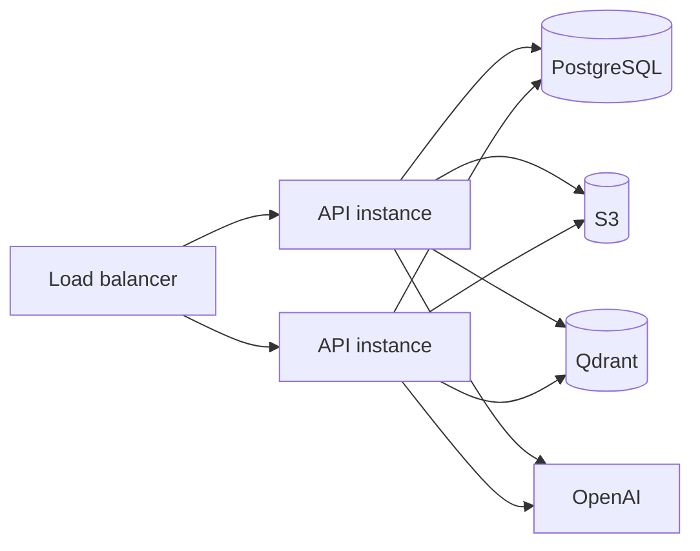

# Deployment and Operations

## Runtime Dependencies

### Required at startup

- Node.js 20+
- PostgreSQL
- `DATABASE_URL`
- `AUTH_SECRET`
- `PROJECT_SOURCE_SECRET_KEY`
- `OPENAI_API_KEY`
- `S3_BUCKET`
- `QDRANT_URL`
- `QDRANT_API_KEY`

The vector module and its adapters are currently constructed unconditionally,
and environment validation requires their configuration. This is true even if
the deployment does not expose vector database functionality to users.

### Integration dependencies

| Feature | Dependencies |
|---|---|
| Email verification, reset, invitations | Resend |
| AI synthesis, routing, SQL generation, embeddings | OpenAI |
| Airweave collections | Airweave |
| SQL chat | OpenAI plus reachable PostgreSQL source |
| Vector DB upload/ingestion/retrieval | S3, Qdrant, OpenAI embeddings, PostgreSQL/pg-boss |

## Environment Variables

### Server and auth

| Variable | Required | Default/notes |
|---|---|---|
| `DATABASE_URL` | Yes | Application PostgreSQL and pg-boss |
| `AUTH_SECRET` | Yes | At least 32 characters |
| `NODE_ENV` | No | Controls production/test behavior; set explicitly per environment |
| `PORT` | No | `3000` |
| `BASE_URL` | No | `http://localhost:3000` |
| `TRUSTED_ORIGINS` | No | Local Vite origins |
| `FE_URL` | No | `http://localhost:5173` |
| `DEFAULT_ORGANIZATION_SLUG` | No | `default`; organization assigned after self-registration |

### Email

| Variable | Required | Default/notes |
|---|---|---|
| `RESEND_API_KEY` | For email | Empty disables delivery |
| `FROM_EMAIL` | No | `noreply@example.com` |
| `ENFORCE_RESEND_TEST_RECIPIENTS` | No | Test/e2e delivery guard |

### Test and evaluation controls

| Variable | Required | Default/notes |
|---|---|---|
| `DOTENV_CONFIG_PATH` | Test tooling only | Used to detect `.env.test` and enforce safe Resend recipients |
| `CHAT_EVALS_ENABLED` | Evaluation only | `false`; enables optional LLM-backed response-format evaluation tests |

### SQL connection encryption

| Variable | Required | Default/notes |
|---|---|---|
| `PROJECT_SOURCE_SECRET_KEY` | Yes for SQL connections | Base64-encoded 32-byte AES key |
| `PROJECT_SOURCE_SECRET_KEY_PREVIOUS` | During rotation | Previous key for lazy re-encryption |

### Airweave

| Variable | Required | Default/notes |
|---|---|---|
| `AIRWEAVE_API_KEY` | For Airweave | No client is created without it |
| `AIRWEAVE_BASE_URL` | No | `https://api.airweave.ai` |
| `AIRWEAVE_READ_LOCKDOWN_ENFORCE` | No | Defaults to enabled outside production and disabled in production; set explicitly for controlled rollout |

### OpenAI and chat

| Variable | Required | Default/notes |
|---|---|---|
| `OPENAI_API_KEY` | Yes at startup | Chat code has a keyless fallback, but the vector embedder requires the key during module construction |
| `OPENAI_MODEL` | No | `gpt-5.4-nano` in this checkout |
| `CHAT_SYSTEM_PROMPT` | No | Inline highest-priority override |
| `CHAT_SYSTEM_PROMPT_PATH` | No | File override |
| `CHAT_RATE_LIMIT_TTL` | No | `60000` ms |
| `CHAT_RATE_LIMIT_MAX` | No | `20` |
| `CHAT_AGENT_MAX_ITERATIONS` | No | `5` |
| `CHAT_AGENT_TOOL_RESULT_LIMIT` | No | `12` |
| `CHAT_AGENT_TOOL_RESULT_CHAR_CAP` | No | `3000` |
| `CHAT_AGENT_MAX_SOURCES` | No | `15` |
| `CHAT_AGENT_HISTORY_WINDOW` | No | `6` |
| `CHAT_AGENT_SEARCH_TIER` | No | `classic` |
| `CHAT_AGENT_RETRIEVAL_STRATEGY` | No | Provider default |

### Fast chat router

| Variable | Required | Default/notes |
|---|---|---|
| `CHAT_ROUTER_ENABLED` | No | `false` |
| `CHAT_ROUTER_MODEL` | No | Falls back to `OPENAI_MODEL` |
| `CHAT_ROUTER_CONFIDENCE_PCT` | No | Percentage threshold parsed by ConfigService |
| `CHAT_ROUTING_RULES` | No | Inline routing taxonomy override |
| `CHAT_ROUTING_RULES_PATH` | No | File override |
| `CHAT_ROUTER_SYSTEM_PROMPT` | No | Inline classifier prompt override |
| `CHAT_ROUTER_SYSTEM_PROMPT_PATH` | No | File override |

### SQL agent

| Variable | Required | Default/notes |
|---|---|---|
| `SQL_AGENT_MODEL` | No | Falls back to `OPENAI_MODEL` |
| `SQL_AGENT_MAX_ITERATIONS` | No | Bounded sub-agent loop |
| `SQL_AGENT_STATEMENT_TIMEOUT_MS` | No | `5000` |
| `SQL_AGENT_IDLE_TIMEOUT_MS` | No | ConfigService bounded default |
| `SQL_AGENT_CONNECT_TIMEOUT_MS` | No | ConfigService bounded default |
| `SQL_AGENT_MAX_ROWS` | No | `200` |
| `SQL_AGENT_MAX_BYTES` | No | Result payload bound |
| `SQL_AGENT_MAX_FIELD_BYTES` | No | Per-field bound |
| `SQL_AGENT_MAX_SQL_LENGTH` | No | Statement length bound |
| `SQL_AGENT_POOL_MAX` | No | Small request-scoped pool |
| `SQL_AGENT_SAMPLE_ROWS` | No | `0` disables schema sample rows |
| `SQL_AGENT_PREWARM_SCHEMA_ENABLED` | No | `false` |
| `SQL_AGENT_DROP_CHECKER_ENABLED` | No | `false` |
| `SQL_AGENT_SYSTEM_PROMPT` | No | Inline override |
| `SQL_AGENT_SYSTEM_PROMPT_PATH` | No | File override |
| `SQL_TOOL_USAGE_PROMPT` | No | Inline tool behavior override |
| `SQL_TOOL_USAGE_PROMPT_PATH` | No | File override |
| `QUERY_DATABASE_TOOL_DESCRIPTION` | No | Inline outer-tool override |
| `QUERY_DATABASE_TOOL_DESCRIPTION_PATH` | No | File override |

`SQL_AGENT_ALLOW_WRITES` exists in configuration but the production safety
model and SQL validator are read-only. Do not enable write behavior without a
separate architecture and security review.

### Vector databases

| Variable | Required | Default/notes |
|---|---|---|
| `S3_BUCKET` | Yes at startup | AWS SDK default credential chain supplies credentials |
| `S3_REGION` | No | `us-east-1` |
| `AWS_ACCESS_KEY_ID` | Credential-chain dependent | Static AWS credential option; prefer workload identity where available |
| `AWS_SECRET_ACCESS_KEY` | Credential-chain dependent | Static AWS credential option; secret |
| `AWS_SESSION_TOKEN` | Credential-chain dependent | Temporary credential token |
| `QDRANT_URL` | Yes at startup | Qdrant REST endpoint |
| `QDRANT_API_KEY` | Yes at startup | Secret |
| `EMBEDDING_MODEL` | No | `text-embedding-3-small` |
| `EMBEDDING_BATCH_SIZE` | No | ConfigService bounded default |
| `EMBEDDING_CONCURRENCY` | No | ConfigService bounded default |
| `VECTOR_DB_MIN_SCORE_PCT` | No | `30`; minimum vector similarity percentage, `0` disables filtering |

Changing the embedding model after vectors exist may change dimensions and
requires a new collection/reingestion strategy.

## Local Startup

```bash
npm install
cp .env.example .env
createdb api_velocity
psql -d api_velocity \
  -f src/shared/infrastructure/database/migrations/001_initial_schema.sql
npm run start:dev
```

Startup performs:

1. NestJS module construction;
2. domain migration initialization;
3. pg-boss schema/startup and worker registration;
4. vector ingestion reconciliation;
5. environment validation;
6. Better Auth email and post-signup callback wiring;
7. HTTP listen.

An environment or infrastructure failure in a required path should fail fast.

## Production Build

```bash
npm run build
npm run start:prod
```

The build copies Markdown prompt assets into `dist/modules/chat/prompts`.
Container deployments must include the resulting `dist` tree and runtime
dependencies.

## Infrastructure Topology



pg-boss coordinates queue work through PostgreSQL. Each node currently allows
two local ingestion jobs; size application replicas and downstream rate limits
accordingly.

The diagram describes a possible topology, not a claim that replica safety is
fully automatic:

- every API instance starts an ingestion worker;
- the NestJS throttler uses process-local storage, so chat limits are enforced
  per instance rather than globally;
- startup migrations use check/apply/record sequencing without a documented
  distributed migration lock;
- long-lived SSE responses consume load-balancer and application connections;
- downstream OpenAI, Airweave, Qdrant, S3, and customer database quotas can
  limit throughput before CPU does.

Serialize migrations during deployment, calculate aggregate worker
concurrency, and load-test the exact replica topology.

## Health and Verification

Process liveness:

```bash
curl http://localhost:3000/health
```

This endpoint reports process status, timestamp, and uptime. It does not verify
PostgreSQL, pg-boss, S3, Qdrant, OpenAI, Airweave, Resend, or attached database
availability.

Basic Better Auth health:

```bash
curl http://localhost:3000/api/auth/ok
```

Build and tests:

```bash
npm run build
npm test
npm run test:e2e
npm run test:smoke
```

Feature verification:

- authenticate and retrieve `/api/rbac/my-permissions`;
- create a project in an active organization;
- connect and test a SELECT-only PostgreSQL source;
- create an Airweave collection if configured;
- upload a small text file and wait for vector DB `ready`;
- create a project conversation and inspect SSE events.

## Production Readiness Gates

Before broad or regulated production use, the deployment owner should define
and verify:

| Area | Required decision or evidence |
|---|---|
| Service objectives | Availability and latency SLOs, error budget, support hours, and escalation ownership |
| Recovery | RTO, RPO, automated PostgreSQL/S3 backups, restore test, and provider outage procedures |
| Readiness | Dependency-aware readiness checks and load-balancer behavior during degraded startup |
| Migrations | One migration owner or another deployment mechanism that prevents concurrent startup migrations |
| Scaling | Tested API replica count, SSE concurrency, worker count, pools, queue depth, and provider quotas |
| Abuse controls | Shared rate limiting or an explicit acceptance of per-instance limits |
| Observability | Request IDs, structured metrics, traces, dashboards, alerts, and durable privileged-action audit events |
| AI quality | Retain the synthetic 100-question RAG baseline and add versioned customer-domain correctness, evidence, refusal, injection, SQL-routing, latency, and cost thresholds |
| Cost | Per-tenant usage attribution, budgets, alerts, and hard/soft quota behavior |
| Data governance | Classification, residency, retention, legal hold, provider terms, and verified deletion |
| Security | CSP, secret manager, egress policy, key rotation, dependency scanning, and incident response |
| Compatibility | Coordinated frontend/backend release, rollback, API deprecation, and migration compatibility policy |

The cross-repository
[Executive and architecture review](https://github.com/TierOne-Studio/spa-velocity/blob/main/docs/executive-architecture-review.md)
contains the corresponding CTO and buyer questions.

## Database Operations

### Application database

- back up before schema changes;
- preserve the startup migration ordering;
- monitor connection consumption from the API, pg-boss, and agent source pools;
- do not use `synchronize: true` as a migration strategy.

### Attached databases

Every production connection must use:

- a dedicated login;
- SELECT-only grants;
- the smallest useful table allowlist;
- TLS where available;
- network egress controls;
- no access to credential, session, or secret tables.

Follow [SQL connections operations](sql-connections-operations.md).

## Backup, Recovery, and Data Lifecycle

The repositories do not define a universal backup or retention policy. The
operator must decide which data is authoritative and how each store is
recovered:

| Store | Contains | Required operational decision |
|---|---|---|
| Application PostgreSQL | Identity, organizations, permissions, projects, chat, source references, ingestion jobs, pg-boss | Backup frequency, PITR, encryption, restore testing, RPO/RTO |
| S3 | Original uploaded documents | Versioning, retention, lifecycle, replication, purge evidence |
| Qdrant | Extracted chunk vectors and text payloads | Snapshot/restore or deterministic rebuild strategy, purge evidence |
| Airweave | Upstream collections and connected-source indexes | Provider backup/retention terms and orphan reconciliation |
| Customer PostgreSQL | Live source data queried by the agent | Customer-owned availability, grants, audit, and revocation |
| Logs | Operational identifiers and failure context | Retention, access control, redaction, legal hold, and deletion |

Current deletion limitations:

- an S3 object can remain after a partial upload or failed delete;
- deleting an uploaded file does not currently remove its Qdrant points;
- Qdrant collection and point deletion is deferred to a janitor;
- soft-deleted vector database records remain because the purge mechanism is
  not implemented;
- Airweave create/ownership partial failure can leave an upstream orphan;
- no end-to-end erasure report proves deletion across all providers.

Until reconciliation jobs and deletion evidence exist, do not promise a strict
cross-provider deletion SLA. Organization deletion can also be blocked by
vector database records using restrictive foreign keys; resolve owned sources
before deleting the organization.

Recovery must be exercised, not inferred from having backups. At minimum, test
PostgreSQL restoration, queue/job consistency, S3/Qdrant alignment, application
startup, authentication, and one end-to-end chat path.

## Key Rotation

SQL passwords are encrypted with a master key. Rotation uses:

1. move the old current key to `PROJECT_SOURCE_SECRET_KEY_PREVIOUS`;
2. deploy a new current `PROJECT_SOURCE_SECRET_KEY`;
3. allow normal traffic to lazily re-encrypt rows;
4. monitor lazy-upgrade logs;
5. remove the previous key after a complete traffic cycle.

See [SQL key rotation](sql-connections-key-rotation.md).

## Observability

Recommended production metrics:

- HTTP latency/error rate by route;
- chat duration and route (`agent`, `rag`, `sql`);
- tool-call count and token usage;
- retrieval result count and provider failure count;
- SQL query duration, timeout, truncation, and rejection codes;
- active database pools;
- ingestion queue depth, retry count, stale-job recovery, and terminal failures;
- Qdrant/OpenAI/Airweave/Resend error rates;
- session and permission denials.

Recommended alerts:

- repeated environment validation failures;
- chat error-rate or latency spikes;
- SQL dials to unexpected hosts;
- ingestion jobs exhausting retries;
- persistent queue backlog;
- Qdrant collection or embedding dimension errors;
- elevated 403s that may indicate role or organization configuration drift.

## Security Operations

- never log tokens, passwords, cookies, SQL result rows, or request bodies;
- keep all secrets outside source control;
- treat `VITE_*` as public;
- restrict API egress;
- rotate Better Auth, SQL encryption, OpenAI, Airweave, Qdrant, S3, and Resend
  credentials;
- inspect impersonation and cross-organization use;
- maintain the SQL validator denylist alongside database role grants;
- review Airweave orphan logs and reconcile upstream resources when ownership
  recording fails.

## Known Operational Gaps

- `/health` is process liveness only; there is no dependency-aware readiness
  endpoint;
- no request IDs or distributed tracing;
- no dedicated metrics exporter;
- no durable compliance-grade audit subsystem;
- no automatic S3/Qdrant/vector-record orphan janitor for every partial
  failure or deletion;
- Airweave orphan cleanup is an operator concern until a reconciler is added;
- Airweave direct-read ownership defaults to observe-only in production until
  the deployment explicitly enables `AIRWEAVE_READ_LOCKDOWN_ENFORCE`;
- chat throttling is process-local rather than shared across replicas;
- startup migrations are not protected by a documented distributed lock;
- LLM cost accounting does not fully include sub-agent usage or tenant budgets;
- the synthetic benchmark is not automated as a customer-domain release gate
  and does not cover refusal, injection, SQL routing, or complete cost criteria;
- missing `RESEND_API_KEY` logs email activity and returns without delivery,
  which is unsuitable when verification or invitations are mandatory;
- email verification logging currently includes recipient and URL details;
  remove or redact token-bearing URLs and PII before production;
- private/RFC1918 PostgreSQL source hosts are rejected by the current SSRF
  policy, so private enterprise database access needs a deliberate connector or
  private-network architecture;
- startup module migration coupling requires careful deployment review.

## Incident Triage

### Chat errors

Check the generator/route log, OpenAI configuration, attached source status,
provider errors, rate limits, and conversation organization scope.

### SQL errors

Check sanitized error code, dial log, DNS/SSRF validation, role grants,
allowlisted tables, statement timeout, and pool cleanup. Do not weaken the
read-only validator to make a query pass.

### Vector ingestion errors

Inspect the ingestion job status and error, S3 object, document MIME type,
extractor logs, OpenAI embedding response, Qdrant collection, and retry count.

### Tenant isolation concern

Disable the affected source, capture user/organization/project/connection IDs,
inspect permission and ownership checks, and verify repository queries include
organization scope.
